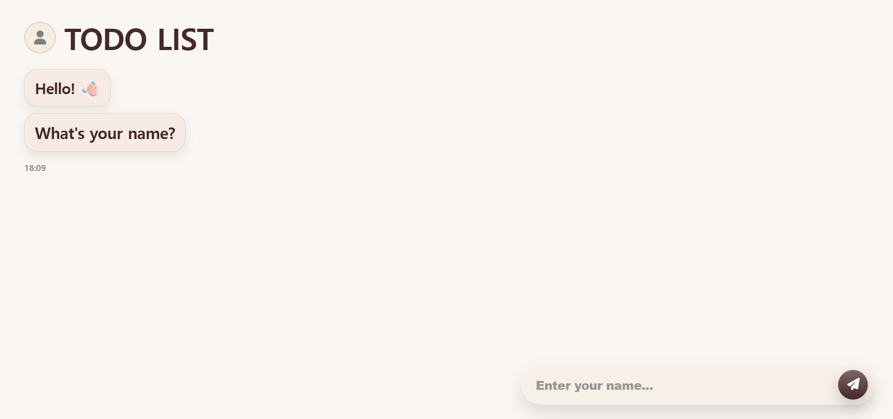
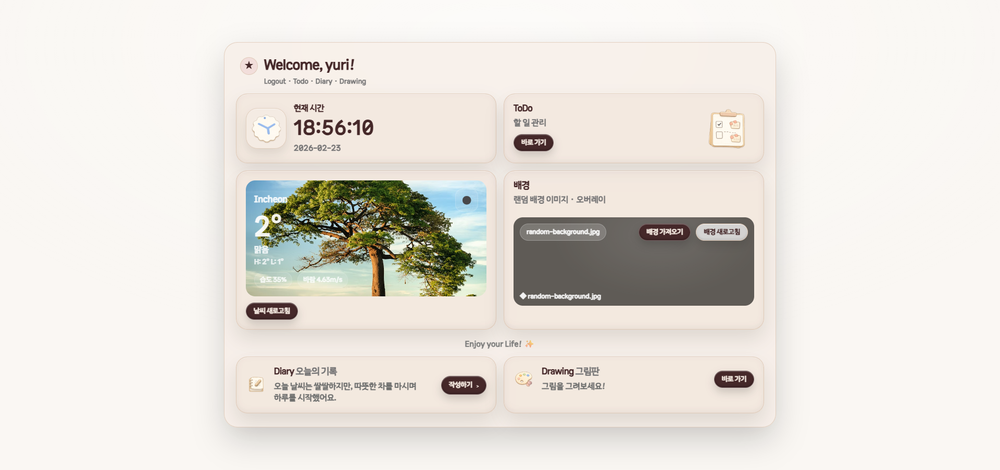
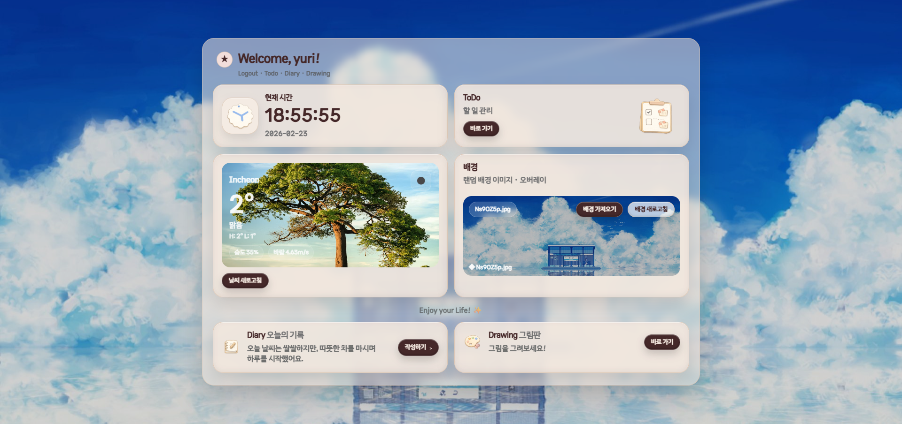
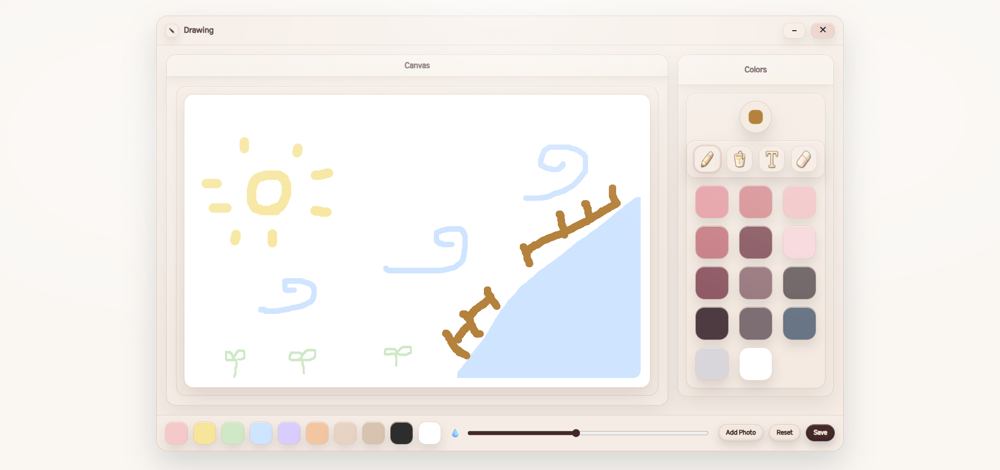
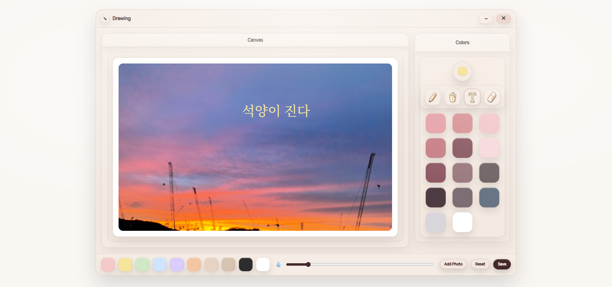
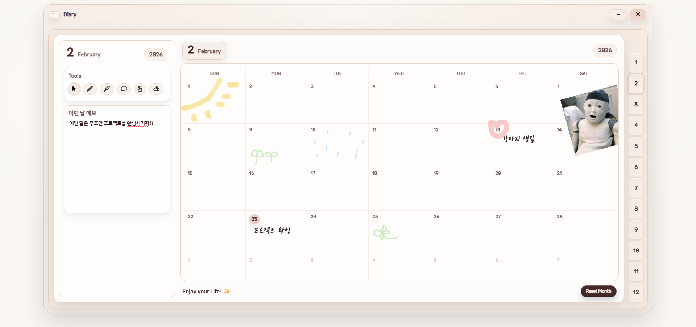
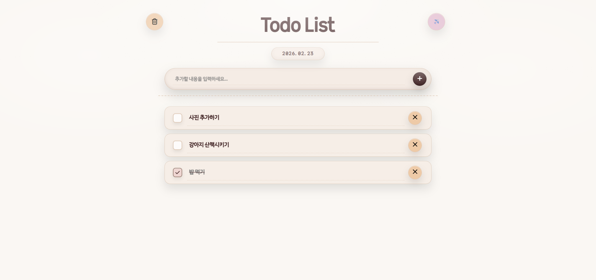

# 🎨 DayForge

Drawing, Diary, Todo 기능을 포함한  
감성 UI 기반의 멀티 페이지 웹 애플리케이션입니다.  
부드러운 파스텔 톤 UI와 직관적인 도구 배치를 목표로 제작했습니다.

---

## ✨ Features

- ✏️ Stroke (자유 드로잉)
- 🪣 Fill (배경 채우기)
- 🔤 Text 입력
- 🧽 Eraser
- 🎨 Color Picker & Preset Palette
- 📏 Line Width 조절
- 🖼️ 이미지 추가
- 💾 PNG 저장
- 📱 반응형 UI (ResizeObserver 적용)

---

## 🧱 Tech Stack

- HTML5
- CSS3 (Custom Design System)
- Vanilla JavaScript (ES Module)
- Canvas API

---

## 📂 Project Structure

```text
/
├─ index.html              # 메인 진입
├─ login.html              # 로그인
├─ diary.html              # 다이어리
├─ drawing.html            # 드로잉 캔버스
├─ todo.html               # 투두
│
├─ css/
│  ├─ tokens.css           # 디자인 토큰
│  ├─ base.css             # 공통 베이스 스타일
│  ├─ components/          # 재사용 UI 컴포넌트
│  └─ pages/               # 페이지별 스타일
│
├─ js/
│  ├─ app/                 # 페이지 단위 로직
│  ├─ shared/              # 공용 모듈
│  └─ ext/                 # 부가 기능 스크립트
│
└─ img/                    # 아이콘 및 이미지 리소스
```

---

## 📸 Screenshots

### login


### Main



### Drawing



### Diary


### Todo


---

## 🚀 How to Run

```bash
# 로컬 서버 권장 (모듈 사용)
npx serve
```